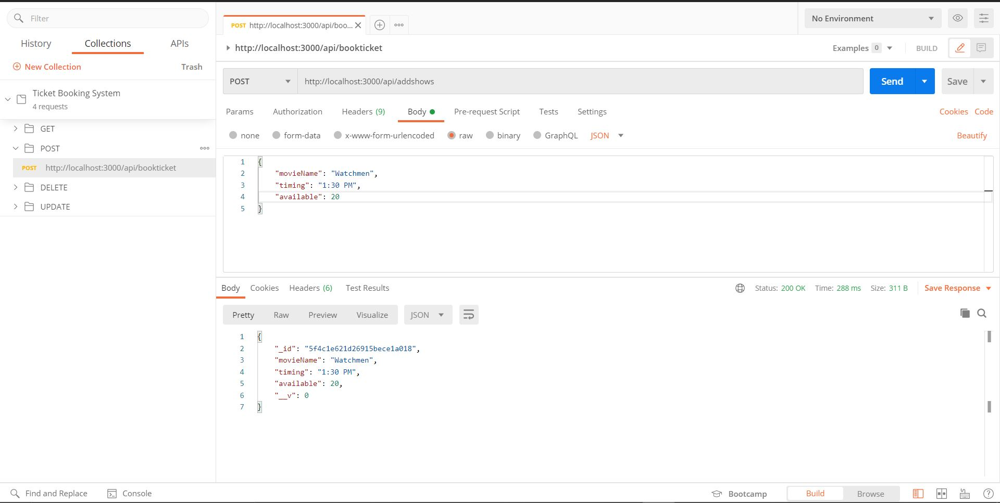
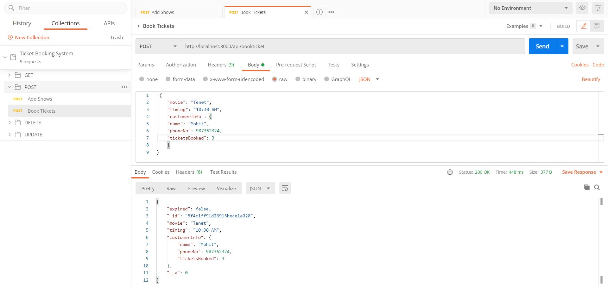
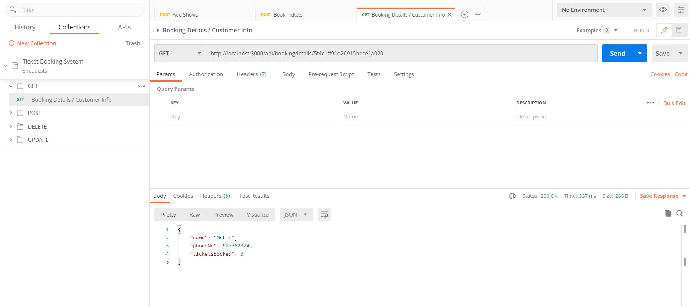
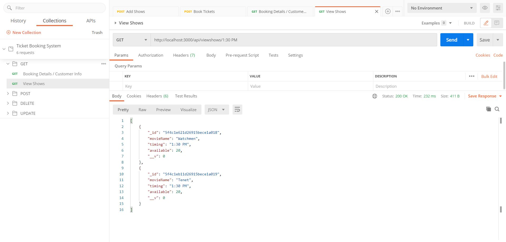
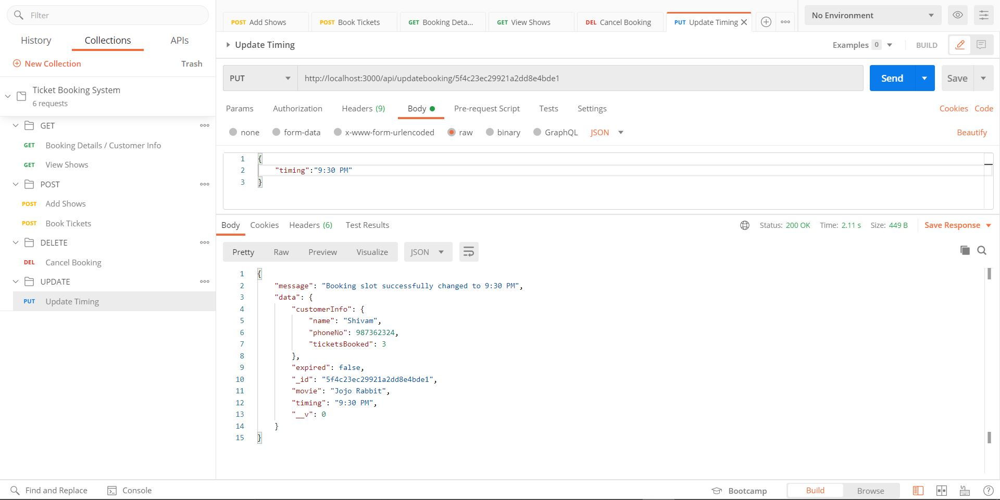
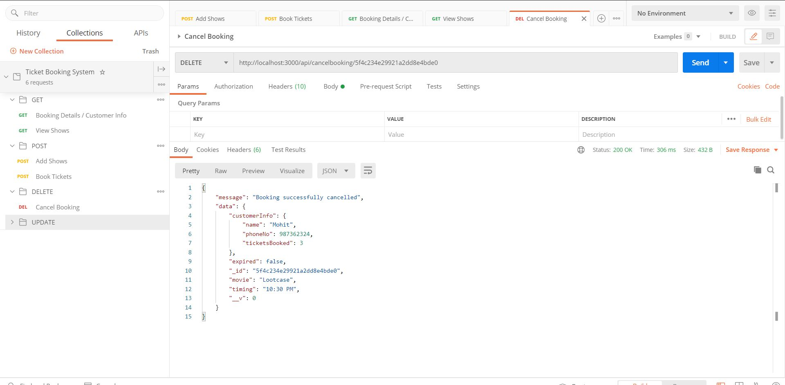
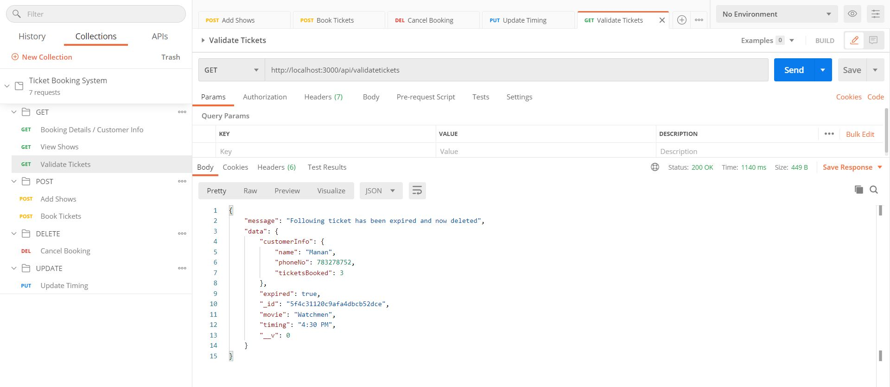

# Movie-Ticket-Backend

## Objective
- Design a REST interface for a movie theatre ticket booking system.

## Requirements:
- The customer can book a movie if it's available.
- The customer can update the timings if some other slot is available for the same movie.
- All the shows can be fetched for a particular time.
- Customer's personal details can be fetched through the ticket id issued.
- The customer can cancel the booking/ delete the ticket.
- No more than 20 people can book for the same show.
- Tickets will get expire if the difference between the current time and the show is >= 8 hours

## Tech Stack
- Backend: Nodejs
- Database: MongoDB

## Installation & Testing
- Download the repo.
- Install the packages with,
```sh
 npm install
```
- And you're good to go, database is accessible so feel free to try it out on your machine.
- Also test suites for basic endpoints are added. To run them write,
```sh
 npm run test
```
## Database Design
### TicketsSchema
| movie | timing | expired | CustomerInfo |
| ------ | ------ | ------ |   ------ |
| String | String | Boolean | {name:string , phoneNo:Number , ticketsBooked:Number} |
### ShowSchema
| movieName | timing | available |
| ------ | ------ | ------ |  
| String | String | Number |

## Postman Screenshots
- Add Shows 


- Book Ticket


- Booking Details


- View Shows


- Update Booking


- Cancel Booking


- Validate Tickets

